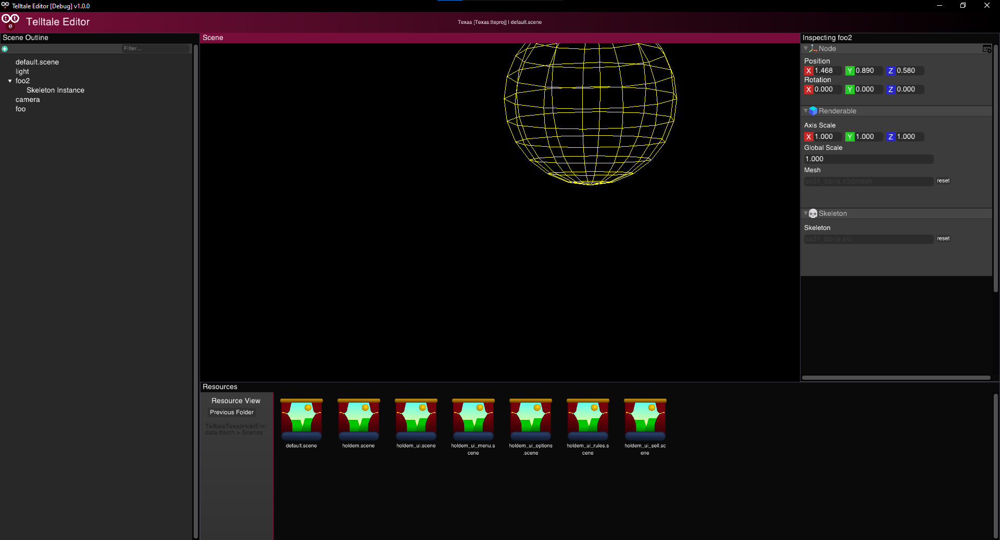

# Telltale Editor

This project is an all in one modding application for all games made in the Telltale Tool by Telltale Games. For information about how it works, what you can do with it and more, see the [wiki](https://github.com/Telltale-Modding-Group/Telltale-Editor/wiki).
This can be built for Windows, MacOS and Linux.

### How to build

This project uses CMake and to build everything you can use the build scripts. Simply run them passing in 'release' as the argument on your machine to build.

### For Linux Users

Note that this project is mainly tested on Windows and MacOS. Linux is supported but may have bugs so please report them.
Zenity must be installed before using Telltale Editor on Linux! If not file dialogs won't open!

## Authors

This project was made possible by lots of work done by various people. 

All C++ and C implementation, and Lua Classes:
#### [Lucas Saragosa](https://github.com/LucasSaragosa)

Lua classes and CMake build system as well as UI development:
#### [Ivan ('DarkShadow')](https://github.com/iMrShadow)

Initial testing help and github workflows
#### [Asil ('Proton')](https://github.com/asilz)

Support and future help
#### [David M.](https://github.com/frostbone25)
